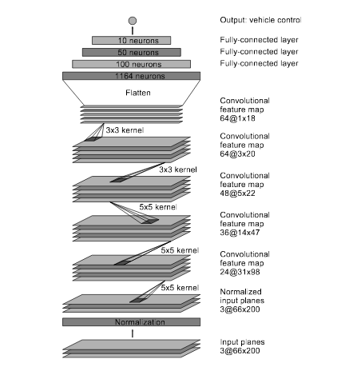
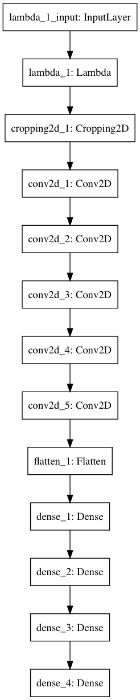
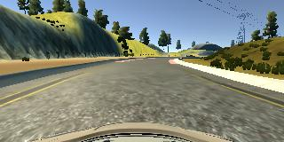
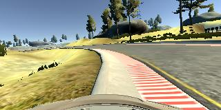
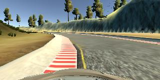
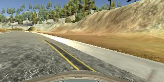
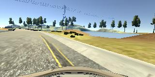
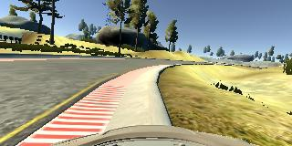
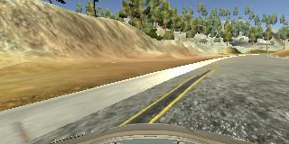

# **Behavioral Cloning**

---

**Behavioral Cloning Project**

The goals / steps of this project are the following:
* Use the simulator to collect data of good driving behavior
* Build, a convolution neural network in Keras that predicts steering angles from images
* Train and validate the model with a training and validation set
* Test that the model successfully drives around track one without leaving the road
* Summarize the results with a written report

## Rubric Points
### Here I will consider the [rubric points](https://review.udacity.com/#!/rubrics/432/view) individually and describe how I addressed each point in my implementation.  

---
### Files Submitted & Code Quality

#### 1. Submission includes all required files and can be used to run the simulator in autonomous mode

My project includes the following files:
* model.py containing the script to create and train the model
* drive.py for driving the car in autonomous mode
* model.h5 containing a trained convolution neural network
* run1.mp4 my test run on track 1
* READEME.md summarizing the results

#### 2. Submission includes functional code
Using the Udacity provided simulator and my drive.py file, the car can be driven autonomously around the track by executing
```sh
python drive.py model.h5
```

#### 3. Submission code is usable and readable

The model.py file contains the code for training and saving the convolution neural network. The file shows the pipeline I used for training and validating the model, and it contains comments to explain how the code works.

### Model Architecture and Training Strategy

#### 1. An appropriate model architecture has been employed

My model consists of a convolution neural network with 3x3 and 5x5 filter sizes and depths between 24 and 64 (model.py lines 75-95)

The model includes RELU layers to introduce nonlinearity the data is normalized in the model using a Keras lambda layer (model.py line 81).

#### 2. Attempts to reduce overfitting in the model

I followed the advice from the forum to use the Nvidia network because it simply works. I am not sure whether my understanding about the network structure is correct but it seems like there is no dropout layer in the Nvidia network.



We know that dropout layer is used to prevent overfitting but it seems to be ok for my training process.

Epoch 1/10
201/200 [==============================] - 648s - loss: 0.0734 - acc: 0.1774 - val_loss: 0.0700 - val_acc: 0.1672

Epoch 2/10
201/200 [==============================] - 661s - loss: 0.0677 - acc: 0.1782 - val_loss: 0.0681 - val_acc: 0.1656

Epoch 3/10
201/200 [==============================] - 682s - loss: 0.0646 - acc: 0.1786 - val_loss: 0.0668 - val_acc: 0.1780

#### 3. Model parameter tuning

The model used an adam optimizer, so the learning rate was not tuned manually.

#### 4. Appropriate training data

Training data was chosen to keep the vehicle driving on the road. I used a combination of center lane driving, recovering from the left and right sides of the road.

For details about how I created the training data, see the next section.

### Model Architecture and Training Strategy

#### 1. Solution Design Approach

In order to gauge how well the model was working, I split my image and steering angle data into a training and validation set. Also I followed the instructions to crop the top part of each image so the model will focus on identifying the road.

The final step was to run the simulator to see how well the car was driving around track one. Well, it drives like a drunk man and tweaking the steering angle a lot especially when it turns. After the bridge, it detected something wrong and went dramatically left. However, it did manage to recover in the end, which means the model does learn something from my training set!

I think maybe adding some dropout layers would help but actually it gives me worse result. The car won't recover when it goes off lane or sometimes it stucks on the bridge. So my best model in the end is the one without dropout layers.

#### 2. Final Model Architecture

The final model architecture (model.py lines 75-95) consisted of a convolution neural network with the following layers and layer sizes.

| Layer (type)			        |     Output Shape	        					| Param #|
|:---------------------:|:---------------------------------------------:|
|lambda_1 (Lambda)  | (None, 160, 320, 3)| 0 |
|cropping2d_1 (Cropping2D)  | (None, 90, 320, 3)| 0 |
|conv2d_1 (Conv2D)  | (None, 43, 158, 24)| 1824 |
|conv2d_2 (Conv2D)  | (None, 20, 77, 36)| 21636 |
|conv2d_3 (Conv2D)  | (None, 8, 37, 48)| 43248 |
|conv2d_4 (Conv2D)  | (None, 6, 35, 64)| 27712 |
|conv2d_5 (Conv2D)  | (None, 4, 33, 64)| 36928 |
|flatten_1 (Flatten)  | (None, 8448)| 0 |
|dense_1 (Dense)  | (None, 100)| 844900 |
|dense_2 (Dense)  | (None, 50)| 5050 |
|dense_3 (Dense)  | (None, 10)| 510 |
|dense_4 (Dense)  | (None, 1)| 11 |

Here is a visualization of the architecture



#### 3. Creation of the Training Set & Training Process

To capture good driving behavior, I first recorded two laps on track one using center lane driving. Here is an example image of center lane driving:



I then recorded the vehicle recovering from the left side and right sides of the road back to center so that the vehicle would learn to recover when it goes off-lane. These images show what a recovery looks like.

  

  

To augment the data sat, I also flipped images and angles thinking that this would help the model understand different conditions better. For example, here is an image that has then been flipped:

  

After the collection process, I had 23993x3x2 number of data points. I then preprocessed this data by defining a generator function since the training set is too large to fit into the memory.


I finally randomly shuffled the data set and put 10% of the data into a validation set.

I used this training data for training the model. The validation set helped determine if the model was over or under fitting. I used an adam optimizer so that manually training the learning rate wasn't necessary.
